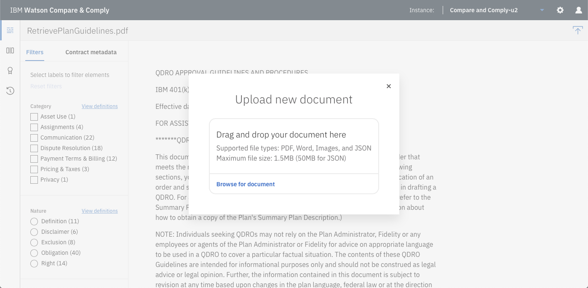
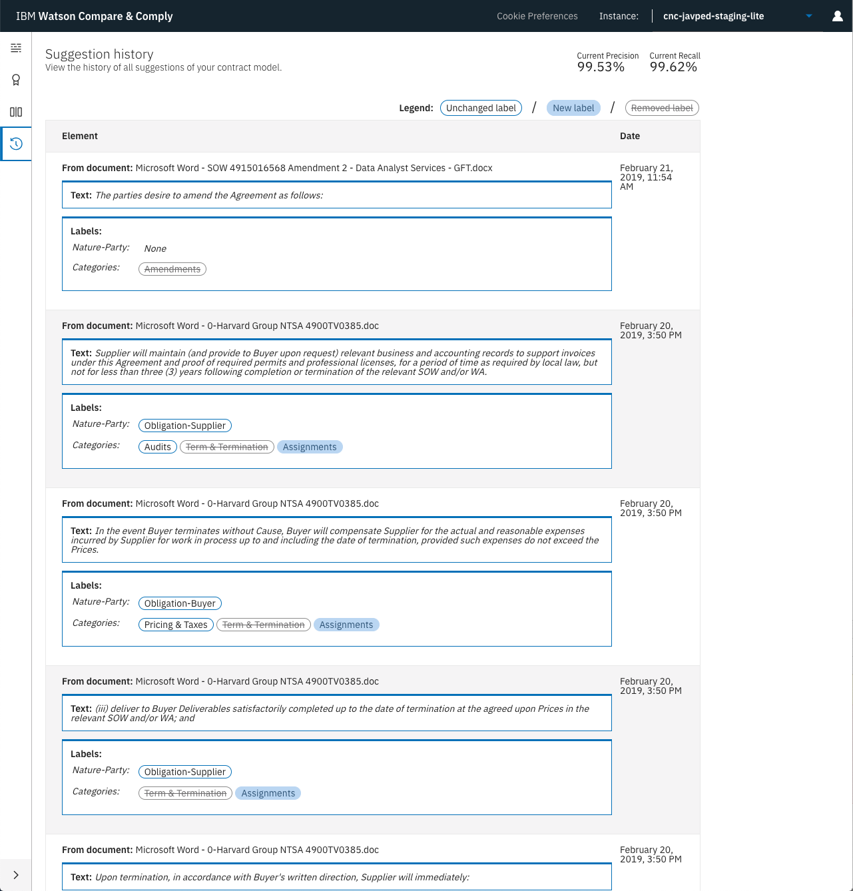
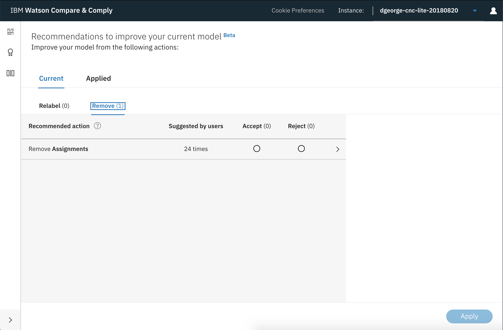
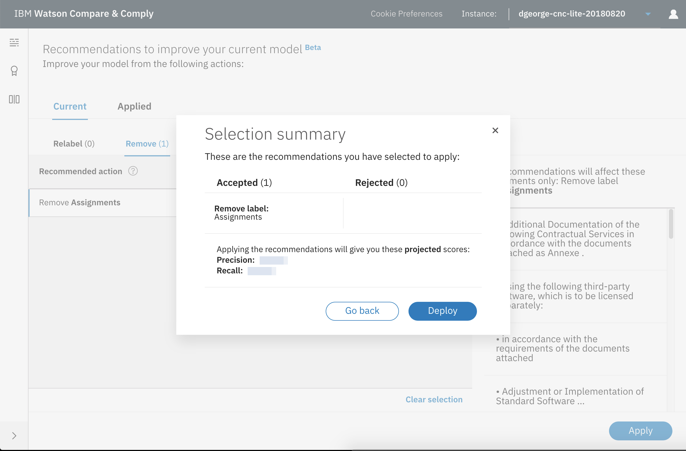
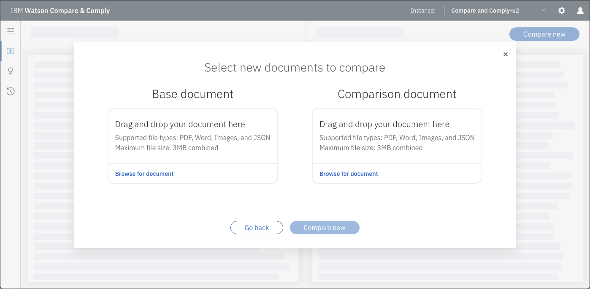
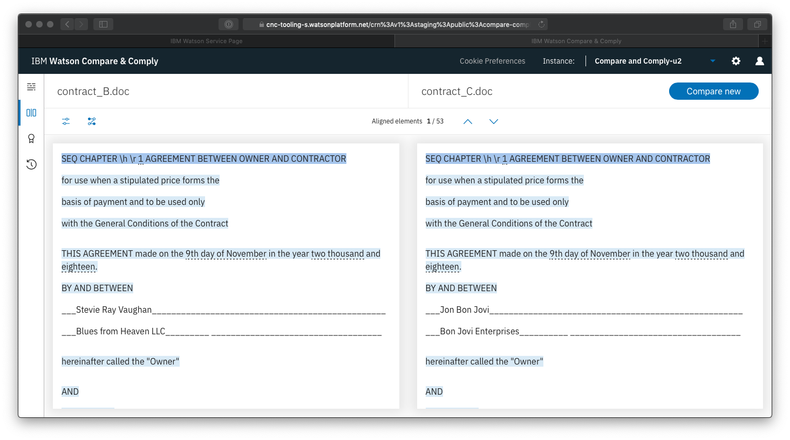
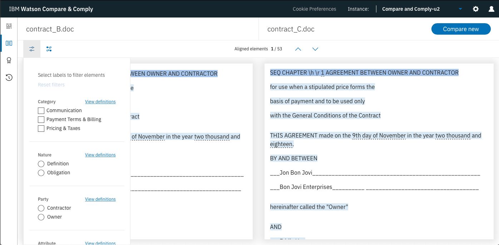

---

copyright:
years: 2018, 2019
lastupdated: "2019-09-04"

keywords: tool,tooling,gui,suggstion,suggestions,compare,comparison,analyze,analysis,document,documents

subcollection: compare-comply

---

{:shortdesc: .shortdesc}
{:external: target="_blank" .external}
{:tip: .tip}
{:pre: .pre}
{:codeblock: .codeblock}
{:screen: .screen}
{:note: .note}
{:important: .important}
{:preview: .preview}
{:javascript: .ph data-hd-programlang='javascript'}
{:java: .ph data-hd-programlang='java'}
{:python: .ph data-hd-programlang='python'}
{:swift: .ph data-hd-programlang='swift'}
{:curl: #curl .ph data-hd-programlang='curl'}

# Using the {{site.data.keyword.cncshort}} Tooling
{: #using_tool}

The {{site.data.keyword.cncshort}} Tooling enables you to work with governing documents in a GUI environment. This tutorial introduces the Tooling and takes you through the process of uploading and processing documents, then working with the results.
{: shortdesc}

## Tooling capabilities
{: #tooling-capabilities}

The {{site.data.keyword.cncshort}} Tooling provides the following capabilities:

  - **Analyze**: Enables you to use the **Element Classification** feature in a visual environment. It also provides the ability to provide suggestions to update and improve the training models.

  - **Recommendations**: Enables you to customize your service instance based on labeling recommendations that are based on suggestions that your users entered by using either the Tooling or the [**Feedback** APIs](/docs/services/compare-comply?topic=compare-comply-feedback).

      The **Recommendations** feature is available only on `Premium` plans. See [https://cloud.ibm.com/account/settings](https://cloud.ibm.com/account/settings){: external} for information about your plan.
      {: important}

  - **Compare**: Enables you to use the **Comparison** feature in a visual environment by uploading two documents. The Tooling shows aligned pairs of text between the two documents. Aligned pairs are classified as _significant_ or _non-identical_. For more information about the **Comparison** feature, see [Comparing two documents](/docs/services/compare-comply?topic=compare-comply-compare).
  
  - **Invoices**: Enables you to use the **Invoice understanding** feature in a visual environment to find and extract important information such as buyer and supplier names, invoice dates, and amounts owed. For more information about the **Invoice understanding** feature, see [Understanding invoice parsing](/docs/services/compare-comply?topic=compare-comply-invoices).
  
  - **Purchase Orders**: Enables you to use the **Purchase order understanding** feature in a visual environment to extract critical information from purchase orders. For more information about the **Purchase order understanding** feature, see [Understanding purchase-order parsing](/docs/services/compare-comply?topic=compare-comply-pos).

  Purchase order understanding and invoice understanding are beta features to which you must request access. For more information, see [Request limited preview features](/docs/services/compare-comply?topic=compare-comply-getting-started#request-preview-features).
  {: important}

## Before you begin
{: #before-you-begin}

You need the following before you can use the {{site.data.keyword.cncshort}} Tooling:

 - An IBM Cloud account.
 - A {{site.data.keyword.cncshort}} service instance. If you already have a service instance, go to Step 1. If you do not have a service instance, see [Getting started](/docs/services/compare-comply?topic=compare-comply-getting-started).
 
## Launching the {{site.data.keyword.cncshort}} Tooling
{: #launch-tool}

1. Navigate to your {{site.data.keyword.cncshort}} service instance on IBM Cloud.

1. If prompted, enter your IBM Cloud login information.

1. Launch the Tooling from the **Manage** tab of your service instance by clicking the **Launch Watson {{site.data.keyword.cncshort}}** button.

## Running element classification
{: #use-tooling-ec}

The Tooling launches and displays the [GDPR ](/docs/services/compare-comply?topic=compare-comply-information-security#gdpr) compliance notice. You can click **Learn more** for additional information. Click **OK** to continue using the Tooling.

The Tooling then displays the landing page. Click **Contracts**. The Tooling opens the **Upload new document** dialog. Click **Browse for document**. The Tooling opens a file browser. Select an [input file](/docs/services/compare-comply?topic=compare-comply-formats) and click **Open**.

The maximum file size is 1.5 MB. However, you can upload JSON output files from the **Element Classification** feature that are up to 50 MB. You can process larger documents by submitting them to Element Classification by [using batch processing](/docs/services/compare-comply?topic=compare-comply-batching) and saving the output to upload to the Tooling. **The JSON _must_ be the output of the Element Classification feature. You cannot upload arbitrary JSON to the tool.**
{: note}

  You can allow IBM Watson to use non-identifiable information from the document for general Watson service improvements. If you want to do so, select the **Allow Watson to use this document for learning** check box. The check box text includes a link to more information at [Understanding request logging in the {{site.data.keyword.cncshort}} Tooling](#request-logging). For more information about IBM's commitment to data privacy, see [https://www.ibm.com/watson/data-privacy/](https://www.ibm.com/watson/data-privacy/){:external}.
  {: tip}
  
Click **Upload and continue**.

You can then perform one or more of the following tasks.

### Filtering elements by labels
{: #filter-elements}

The {{site.data.keyword.cncshort}} Tooling for Element Classification displays four panes. The top pane lists the name of the input file and provides the **Upload new document** icon (). The far left pane enables you to switch to other Tooling functions such as **Compare**. The middle pane enables you to select specific labeled elements to display. The right pane displays the document in HTML format.

 
1. In the left pane, select one or more labels from the **Category** listings. When you select an item, the Tooling highlights the elements in that category. For example, selecting **Dispute Resolution** highlights all elements in the document that match that category.

  Category selections are logical `AND` operations. That is, if you select more than one category, the Tooling highlights only the elements that match all of the selections.
  {: note}
  
  
 
1. After selecting the category, you can select one or more active labels from the **Nature** listings, the **Party** listings, or both. As you make additional selections, the highlights change to match the combination of selected labels.

  Nature and party selections are logical `OR` operations. That is, if you select more than one nature or party, the Tooling highlights all elements that match any of the selections.
  {: note}
  
  
 
1. Click a highlighted element to display all labels that are applied to the element. You can optionally suggest different classifications for the labels and elements, as described in [Adding suggestions](#add-suggestions).
   

1. Use the up and down arrows to the right of the document to cycle through elements that match the specified labels.

1. Optionally, click **Reset filters** to clear all labels.

1. Optionally, open another document by clicking the **Upload new document** icon (). The Tooling opens a file browser. Proceed as described in Step 2.
   

See [Understanding element classification](/docs/services/compare-comply?topic=compare-comply-contract_parsing) for listings and descriptions of all available categories, natures, and parties.

### Displaying contract metadata
{: #display-metadata}

You can display contract metadata by clicking the **Contract metadata** tab in the middle pane. Contract metadata can include any of the following items:

  - **Parties**, including names and postal addresses.
  - **Effective dates** that are identified in the document.
  - **Contract amounts** (monetary amounts) that are identified in the document.
  - **Termination dates** that are identified in the document.
  - The **contract types** of the document.
  - The **contract terms** of the document.
  
The Tooling displays a list of linked identified metadata items. Click a link to go to the corresponding element in the document. The Tooling highlights the element in orange.
  
{{site.data.keyword.cncshort}} assigns confidence levels to identified **Effective dates**, **Contract amounts**, **Termination dates**, **Contract types**, and **Contract terms** items by using the following scale:
  - Three green dots indicate a **high** level of confidence.
  - Two yellow dots indicate a **medium** level of confidence.
  - One red dot indicates a **low** level of confidence.
  

### Adding suggestions
{: #add-suggestions}

As noted in [Filtering elements by labels](#filter-elements), you can select any highlighted element to display a pop-up window that shows the element's current labels. If you disagree with the labels, you can provide suggestions to be reviewed and potentially incorporated into future updates to the service's learning model.

To provide suggestions in the Tooling, perform the following steps:

1. Open the Tooling, open a document, and apply the labels that you want to examine. Select a highlighted passage to display information about it in the right pane.

1. If you disagree with the information that the Tooling displays, click **Suggest changes**. The **Suggest changes** panel opens.
   .
   
1. The panel lists each labeled element in the highlighted passage. Perform one or more of the following actions:
   - Mark the label as incorrect by clicking the **Incorrect** icon (). The Tooling displays the status message **Marked incorrect** for the element. If you click the icon by accident or change your mind later, click the **Undo** icon ().
   - Suggest a different label for the element by clicking **+ Suggest Label** and selecting a label from the drop-down menu. The Tooling displays the status message **Suggested**. You can undo the suggestion by clicking the **Undo** icon ().
   - Optionally explain your feedback by entering a brief text description in the **Any comments? (optional)** field.
   
   To close the **Suggest changes** panel and abandon your feedback, click the **X** in the upper right corner of the panel.
   
1. When you are done providing feedback on the highlighted element, click **Submit**.

### Viewing the suggestion history
{: #view-suggestions}

You can view the suggestions that have been made in the Tooling by clicking the **Suggestion history** icon (). The **Suggestion history** page opens.

  The **Suggestion history** feature is available only on `Premium` plans. See [https://cloud.ibm.com/account/settings](https://cloud.ibm.com/account/settings){: external} for information about your plan.
  {: important}

## Applying recommendations
{: #apply-recommendations}

You can use recommendations to customize your service instance based on labeling suggestions that users made.

**Recommendations** is available only on `Premium` plans. For information about your plan, see [https://cloud.ibm.com/account/settings](https://cloud.ibm.com/account/settings){: external}.
{: important}

To apply recommendations, perform the following steps:

1. Click the **Recommendations** icon (). The Tooling displays the Recommendations page, which is divided into two tabs:
  - The **Current** tab shows recommendations that were generated but that are not yet accepted or rejected.
  - The **Applied** tab shows recommendations that were accepted and are now part of your service instance model.
  
  
  
  If enough suggestions have been made by users, recommendations appear in the **Current** tab. A recommendation takes one of two types:
    - To _relabel_ a set of elements; that is, to remove the existing label and replace it with another label
    - To _remove_ a label entirely from a set of elements
    
1. Review the list of **Current** recommendations. Click on a recommendation to view the elements to which the recommendation applies.

1. For each recommendation, perform one of the following tasks:
  - To accept a recommendation, select the radio button in the recommendation's **Accept** column. 
  - To reject a recommendation, select the radio button in the recommendation's **Reject** column.

  The **Apply** button at the bottom of the screen becomes active when you first accept or reject a recommendation.
  
1. After you review and accept or reject all recommendations, click **Apply**. The Tooling displays a confirmation dialog box that contains a summary of your selections and an estimate of the precision and recall values for the new model.

  **Warning**: If you reject a recommendation and then click **Apply**, the recommendation is not displayed again.

1. Click **Deploy** to deploy the model. When the model finishes deploying, the Tooling displays a notification at the top of the screen. You can then use the **Document visualizer** to test the new model.

  

## Comparing documents
{: #tool-compare}

You can use the Tooling to compare similar documents and locate aligned pairs of text for easy visual identification of similarities and differences.

The two input documents uploaded for comparison must be of the same filetype. For example, you can compare two PDF files, two Microsoft Word files, or two GIF files. You cannot compare a PDF file to a Word file, or a GIF file to a PNG file.
{: important} 

The combined size of the two compared documents can be no larger than 3 MB.
{: note}

1. Ensure that you meet the requirements that are listed in [Before you begin](#before-you-begin), then [launch the Tooling](#launch-tool).

1. When the Tooling launches, click the **Compare** icon (). The Tooling displays the Comparison  page.

1. In the **Base document** panel, click **Browse for document**. The Tooling opens a file browser. Select an [input file](/docs/services/compare-comply?topic=compare-comply-formats) as the base document for comparison and click **Open**. The panel displays the name of the file that you selected.

1. In the **Comparison document** panel, click  **Browse for document**. The Tooling opens a file browser. Select an [input file](/docs/services/compare-comply?topic=compare-comply-formats) as the base document for comparison and click **Open**. The panel displays the name of the file that you selected.
  
  
1. Click **Compare new**. The Tooling processes the documents and displays a side-by-side comparison of them.
  
  
1. The Tooling lists the number of matched elements that it detected between the two documents and highlights the matched elements in blue. Use the up and down arrows to navigate through the matches.

1. Optionally, click the **Toggle filter list** icon () on the left side of the screen and select different filters.
  

1. Optionally, click the **Toggle display options** icon () on the left side of the screen and select different display options.
  
  
  For example, to display unaligned elements, select the **Unaligned elements** check box. The Tooling displays unaligned elements in yellow.
  
  
<!--
## Using purchase order understanding
{: #tool-po}

## Using invoice understanding
{: #tool-invoice}

-->
  
## Understanding request logging in the {{site.data.keyword.cncshort}} Tooling
{: #request-logging}

By default, all IBM Watson&trade; services log requests and their results. Logged data is used only for ongoing service enhancements, including improvements in user experience, accuracy, and performance. The logged data is not shared or made public. All Watson users benefit from the use of logged data to drive improvements.
  
To permit the {{site.data.keyword.cncshort}} Tooling to provide logging data to IBM, select the **Allow Watson to use this document for learning** check box in the {{site.data.keyword.cncshort}} Tooling each time you upload a document to it. However, if you are concerned about data privacy for any given document or otherwise do not want requests to be used by IBM, leave the check box unselected.

For more information about Watson services' use of request logging, see the  [common Watson documentation](https://cloud.ibm.com/docs/services/watson?topic=watson-gs-logging-overview#controlling-request-logging-for-watson-services){: external}.

  Selecting the check box is the equivalent of setting the API header parameter `X-Watson-Learning-Opt-Out` to `false` or `0` in a programmatic environment, as described in the link in the preceding paragraph. Leaving the check box unselected is the equivalent of setting the `X-Watson-Learning-Opt-Out` parameter to `true` or `1`.
  {: note}

