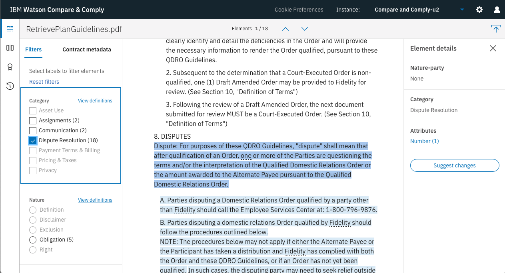
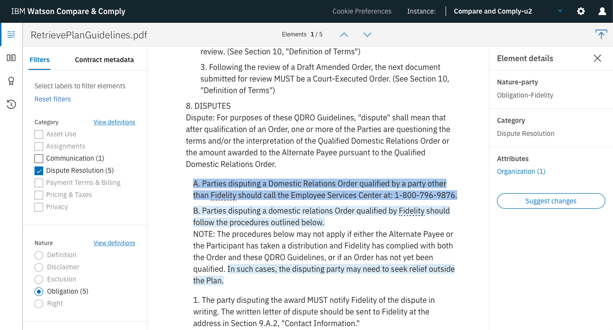
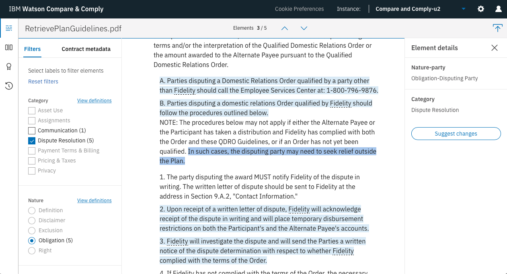
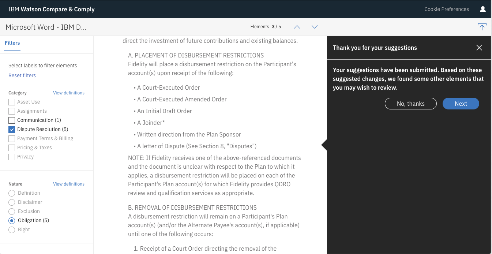
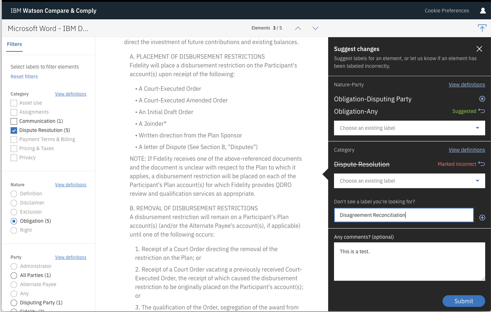

---

copyright:
years: 2018, 2019
lastupdated: "2019-01-08"

---

{:shortdesc: .shortdesc}
{:new_window: target="_blank"}
{:tip: .tip}
{:pre: .pre}
{:codeblock: .codeblock}
{:screen: .screen}
{:note: .note}
{:important: .important}
{:javascript: .ph data-hd-programlang='javascript'}
{:java: .ph data-hd-programlang='java'}
{:python: .ph data-hd-programlang='python'}
{:swift: .ph data-hd-programlang='swift'}

# Using the Compare and Comply Tooling
{: #using_tool}

The service provides Compare and Comply Tooling to enable you to work with governing documents in a GUI environment. This short tutorial introduces the Tooling and takes you through the process of uploading and analyzing documents, then working with the results.
{: shortdesc}

## Before you begin
{: #before-you-begin}

You need the following before you can use the Compare and Comply Tooling:

 - An IBM Cloud account.
 - A Compare and Comply service instance. If you already have a service instance, go to Step 1. If you do not have a service instance, see "Getting Started".
 
## Step 1: Launch the Compare and Comply Tooling
{: #step1}

1. Navigate to your Compare and Comply service instance on IBM Cloud.

1. If prompted, enter your IBM Cloud login information.

1. Launch the Tooling from the **Manage** tab of your service instance by clicking the **Launch tool** button.

## Step 2: Upload a document
{: #step2}

The Tooling launches and displays the landing page. Click **Browse for document**. The Tooling opens a file browser. Select an [input file](/docs/services/compare-comply/formats.html) and click **Open**.

The maximum file size is 1.5 MB. However, you can upload JSON output files from the `/v1/element_classification` method that are up to 50 MB. You can process larger documents by submitting them to Element Classification by [using batch processing](/docs/services/compare-comply/batching.html) and saving the output to upload to the Tooling.
{: note}

  You have the option to allow IBM Watson to use non-identifiable information from the document for general Watson service improvements. If you want to do this, select the **Allow Watson to use this document for learning** checkbox. The checkbox text includes a link to more information at [See more details ](https://console.bluemix.net/docs/services/watson/getting-started-logging.html#controlling-request-logging-for-watson-services){: new_window}. You can also see [https://www.ibm.com/watson/data-privacy/ ](https://www.ibm.com/watson/data-privacy/){:new_window} for information about IBM's commitment to data privacy.
  {: tip}
  
Click **Upload and continue**.

## Step 3: Filter elements by labels
{: #step3}

The Compare and Comply Tooling displays three panes. The top pane lists the name of the input file and provides the **Upload new document** icon (). The left-side pane enables you to select specific labeled elements to display. The right-side pane displays the document in HTML format.

 
1. In the left-hand pane, select one or more labels from the **Category** listings. When you select an item, the Tooling highlights the elements in that category. For example, selecting **Dispute Resolution** highlights all elements in the document that match that category.

  Category selections are logical `AND` operations. That is, if you select more than one category, the Tooling highlights only the elements that match all of the selections.
  {: note}
  
  
 
1. After selecting the category, you can select one or more active labels from the **Nature** listings, the **Party** listings, or both. As you make additional selections, the highlights change to match the combination of selected labels.

  Nature and party selections are logical `OR` operations. That is, if you select more than one nature or party, the Tooling highlights all elements that match any of the selections.
  {: note}
  
  
 
1. Click a highlighted element to display all labels applied to the element. You can optionally provide _feedback_ to the labels and elements, as described in [Adding feedback](#tool-add-feedback).
   

1. Use the up and down arrows to the right of the document to cycle through elements that match the specified labels.

1. Optionally, click **Reset filters** to unselect all labels.

1. Optionally, open another document by clicking the **Upload new document** icon (). The Tooling opens a file browser. Proceed as described in Step 2.
   

See [Understanding contract parsing](/docs/services/compare-comply/parsing.html#contract_parsing) for listings and descriptions of all available categories, natures, and parties.

## Adding feedback
{: #tool-add-feedback}

As noted in Step 3, you can click any highlighted element in the Compare and Comply Tooling to display a pop-up showing the labels that are currently applied to the element. If you disagree with the labels, you can provide feedback to be reviewed and potentially incorporated into future updates to the service's learning model.

For more detailed information about feedback, see [Using the feedback APIs](/docs/services/compare-comply/feedback.html#feedback).

To provide feedback in the Tooling, perform the following steps:

1. As described in the previous steps in this topic, open the Tooling, open a document, and apply the labels you want to examine. Click on a highlighted passage to display the informational pop-up.

1. If you disagree with the information displayed in the pop-up, click **Suggest changes**. The **Feedback** panel opens.
   .
   
1. The panel lists each labeled element in the highlighted passage. Perform one or more of the following actions:
   - Mark the label as incorrect by clicking the  icon. The Tooling displays the status message **Marked incorrect** for the element. If you click the icon by accident or change your mind at a later time, click the  icon.
   - Suggest a different label for the element by clicking **+ Suggest Label** and selecting a label from the drop-down menu. The Tooling displays the status message **Suggested**. You can undo the suggestion by clicking the   icon.
   - Explain your feedback by entering a brief text description in the **Any comments? (optional)** field.
   
   To dismiss the **Feedback** panel and abandon your feedback, click the **X** in the upper right-hand corner of the panel.
   
1. When you have finished providing feedback on the highlighted element, click **Submit**.

1. The **Feedback** panel prompts you for additional feedback.
   
   Click **No, thanks** to finish creating feedback. Click **Next** to provide additional feedback.

The following screen image shows the **Feedback** panel with feedback provided for an arbitrary element.

### Reviewing feedback
{: #review_feedback}

Optionally, review some or all feedback in the document. Elements with feedback are highlighted and have a vertical blue bar before the highlighted text. You can Click the highlight or the bar to open an informational pop-up. The pop-up includes a **Show suggested changes** drop-down; click it to review the previous feedback.
